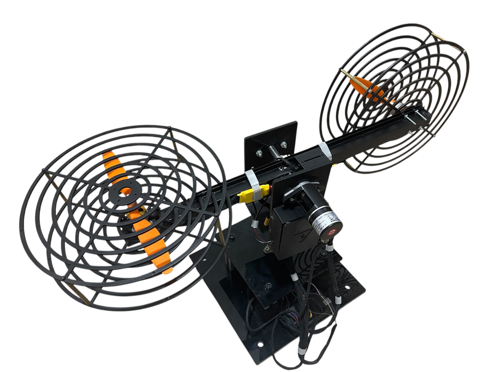
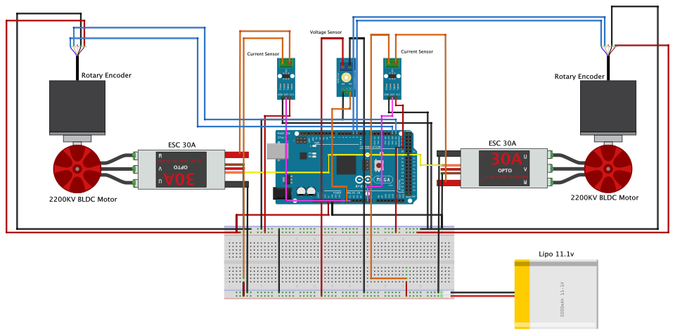

# This repository is dedicated to research project (RP)

## Helicpoter Model:

## Helicpoter Wiring Diagram:

## Related Repositories

### Neural Networks models:

1) For FNN model: check out the [2DOF Helicopter FNN repository](https://github.com/Ahmed-Magdi1/2DOF-Helicopter-FNN.git).

2) For RNNs model: check out the [2DOF Helicopter LSTM repository](https://github.com/Ahmed-Magdi1/2DOF-Helicopter-LSTM.git).

3) For NARX model: check out the [2DOF Helicopter NARX repository](https://github.com/Ahmed-Magdi1/2DOF-Helicopter-NARX.git).
