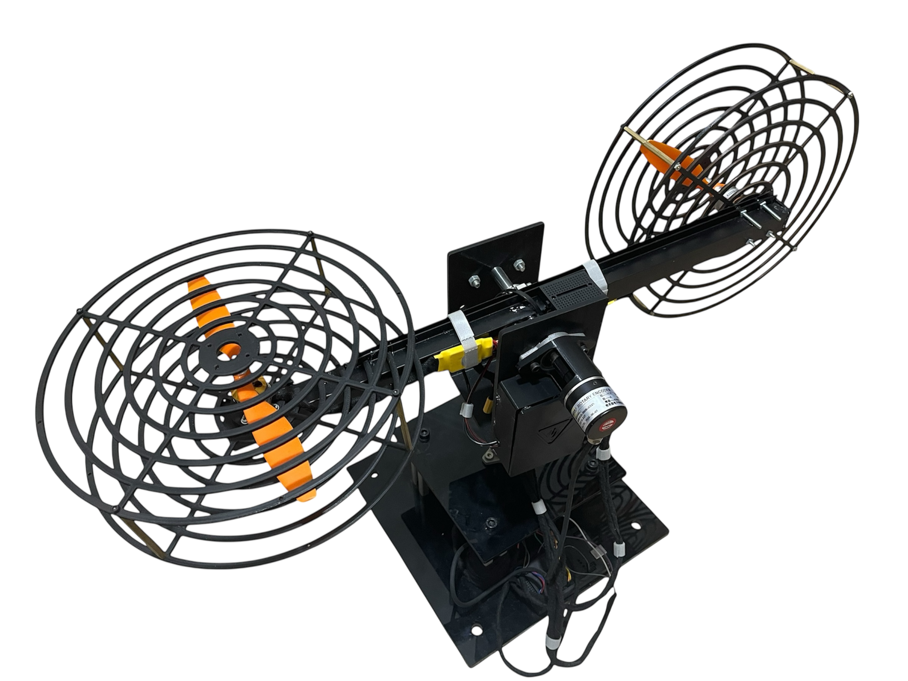

# 2DOF Helicopter System Research Project

This repository contains the main research project (RP) documentation and resources for developing advanced control systems for a 2-Degree-of-Freedom (2DOF) helicopter model using various neural network architectures.

## 🚁 Project Overview

The 2DOF helicopter system is a complex, nonlinear, and highly coupled control challenge that serves as an excellent testbed for advanced control algorithms. This research focuses on implementing and comparing different neural network approaches for helicopter attitude control, including pitch and yaw stabilization.

### Key Features
- **Real-time control implementation**
- **Multiple neural network architectures comparison**
- **Hardware-in-the-loop simulation capabilities**
- **Comprehensive system identification and modeling**

## 🛠️ System Architecture

### Helicopter Model
The physical helicopter model used in this research provides two degrees of freedom for comprehensive control system testing.

**Specifications:**
- **Degrees of Freedom:** 2 (Pitch and Yaw)
- **Control Inputs:** Dual rotor system
- **Sensors:** Encoders for angle measurement
- **Actuators:** DC motors with propellers
- **Coupling:** Strong aerodynamic coupling between axes

### System Wiring and Hardware Integration

**Detailed Wiring Configuration:**
- **Arduino Uno:** Central microcontroller managing all system operations
- **Dual ESC 30A Controllers:** Electronic speed controllers for precise BLDC motor control
- **2200KV BLDC Motors:** High-speed brushless motors for pitch and yaw actuation
- **Rotary Encoders:** Position feedback sensors mounted on both axes
- **Sensor Array:**
  - Current sensors monitoring motor power consumption
  - Voltage sensor for battery level monitoring
- **Power Distribution:**
  - 11.1V LiPo battery as primary power source
  - Breadboard circuit for signal conditioning and power regulation
  - Proper grounding and shielding for noise reduction

**Hardware Components:**
- **Microcontroller:** Arduino-based control unit for real-time processing
- **Motor Drivers:** Dual ESC 30A electronic speed controllers for BLDC motors
- **Motors:** 2200KV BLDC motors with high-performance propellers
- **Sensors:** 
  - Dual rotary encoders for precise angle measurement
  - Current sensors for motor monitoring
  - Voltage sensor for power management
- **Power Supply:** 
  - LiPo 11.1V battery pack for main power
  - Regulated power distribution via breadboard circuits
- **Communication Interface:** USB connectivity for programming and data acquisition

## 🧠 Neural Network Implementations

This research project explores multiple neural network architectures for helicopter control, each implemented in separate repositories for detailed analysis and comparison.

### 1. Feedforward Neural Network (FNN)
**Repository:** [2DOF Helicopter FNN](https://github.com/Ahmed-Magdi1/2DOF-Helicopter-FNN.git)

- **Architecture:** Multi-layer perceptron with backpropagation training
- **Application:** Static mapping of system states to control actions
- **Advantages:** Simple implementation, fast computation
- **Use Case:** Baseline controller for performance comparison

### 2. Long Short-Term Memory (LSTM)
**Repository:** [2DOF Helicopter LSTM](https://github.com/Ahmed-Magdi1/2DOF-Helicopter-LSTM.git)

- **Architecture:** Recurrent neural network with memory cells
- **Application:** Temporal sequence modeling for dynamic control
- **Advantages:** Long-term dependency learning, sequence processing
- **Use Case:** Advanced control with memory of past states

### 3. Nonlinear Autoregressive with Exogenous Inputs (NARX)
**Repository:** [2DOF Helicopter NARX](https://github.com/Ahmed-Magdi1/2DOF-Helicopter-NARX.git)

- **Architecture:** Recurrent network with external input feedback
- **Application:** System identification and predictive control
- **Advantages:** Excellent for nonlinear system modeling
- **Use Case:** Model predictive control implementation
