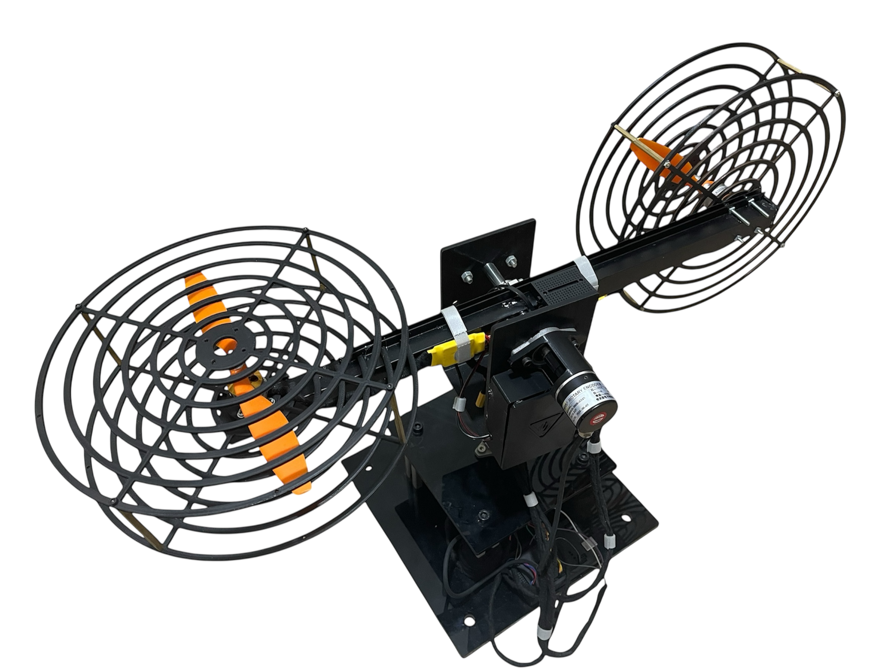
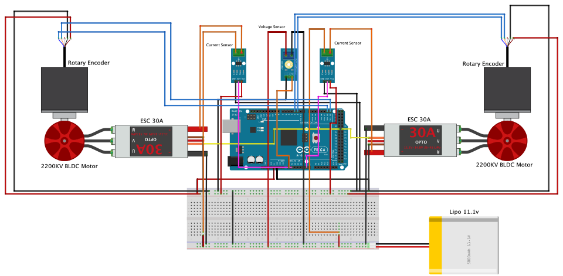

# 2-DOF Helicopter System Research Project

This repository contains the complete research documentation and resources for developing **neural network–based modeling and control systems** for a **2-Degree-of-Freedom (2DOF) helicopter**.
The work focuses on **experimental validation**, **system identification**, and **advanced control** using deep learning–driven approaches.

---

## Research Overview

The **2DOF helicopter** represents a highly nonlinear, coupled, and unstable system, making it an excellent benchmark for testing **intelligent control algorithms**.
This project experimentally investigates **neural network architectures** (FNN, LSTM, NARX) for **system modeling** and integrates them into **control schemes** including PID, Fuzzy Logic, and Model Predictive Control (MPC).

### Main Contributions

* Real-world implementation of **data-driven helicopter control**
* **Comparative study** of FNN, LSTM, and NARX architectures
* **Experimental system identification** via **Differential Evolution (DE)**
* Development of a **NARX–MPC control scheme** achieving superior accuracy and speed
* Comprehensive performance evaluation in **real time (100 Hz sampling)**

---

## System Architecture

### Helicopter Model

The experimental setup allows **pitch** and **yaw** motion, with strong aerodynamic coupling between axes.

**Specifications**

| Parameter          | Description                                       |
| ------------------ | ------------------------------------------------- |
| Degrees of Freedom | 2 (Pitch and Yaw)                                 |
| Control Inputs     | Dual 2200KV BLDC motors                           |
| Sensors            | Dual rotary encoders, voltage & current sensors   |
| Actuators          | Dual ESC 30A controllers                          |
| Controller         | Arduino Mega 2560 (100 Hz sampling rate)          |
| Power Supply       | 11.1V LiPo battery                                |
| Interface          | Serial communication for data logging and control |

---

### System Wiring and Hardware Integration

**Key Components**

| Component            | Function                                                     |
| -------------------- | ------------------------------------------------------------ |
| Arduino Mega 2560    | Executes control loops and handles data acquisition          |
| Dual ESC 30A         | Regulates motor speed                                        |
| BLDC Motors (2200KV) | Provides high-speed propulsion for pitch/yaw axes            |
| Sensors              | Encoders for position, current and voltage monitoring        |
| Power                | 11.1V LiPo battery with regulated distribution and grounding |

---

## Neural Network Implementations

This research explores three neural network models for helicopter dynamics and control.
Each model is developed and tested in its own dedicated repository.

---

### 1. Feedforward Neural Network (FNN)

**Repository:** [2DOF Helicopter FNN](https://github.com/Ahmed-Magdi1/2DOF-Helicopter-FNN.git)

* **Architecture:** Multi-layer perceptron with backpropagation training
* **Application:** Static mapping of system states to control actions
* **Advantages:** Simple implementation, fast computation

---

### 2. Long Short-Term Memory (LSTM)

**Repository:** [2DOF Helicopter LSTM](https://github.com/Ahmed-Magdi1/2DOF-Helicopter-LSTM.git)

* **Architecture:** Recurrent neural network with memory cells
* **Application:** Temporal sequence modeling for dynamic control
* **Advantages:** Long-term dependency learning, sequence processing

---

### 3. Nonlinear Autoregressive with Exogenous Inputs (NARX)

**Repository:** [2DOF Helicopter NARX](https://github.com/Ahmed-Magdi1/2DOF-Helicopter-NARX.git)

* **Architecture:** Recurrent network with external input feedback
* **Application:** System identification and predictive control
* **Advantages:** Excellent for nonlinear system modeling

---

## Experimental Modeling and Results

### Dataset and Identification

| Parameter           | Description                                      |
| ------------------- | ------------------------------------------------ |
| Excitation Signal   | Pseudo-Random Binary Sequence (PRBS)             |
| Sampling Rate       | 100 Hz                                           |
| Experiment Duration | 30 minutes per axis                              |
| Preprocessing       | Low-pass filtering and normalization             |
| Data Split          | 70% training / 15% validation / 15% testing      |
| Optimization        | Differential Evolution for hyperparameter tuning |

---

### Neural Network Performance Comparison

| Model    | R²         | MSE       | Inference Time (s) | Observations                                            |
| -------- | ---------- | --------- | ------------------ | ------------------------------------------------------- |
| FNN      | 0.57       | 3.2       | 0.43               | Weak in temporal modeling                               |
| LSTM     | 0.887      | 0.883     | 1.76               | Learns temporal dependencies, higher computation cost   |
| **NARX** | **0.9992** | **0.005** | **0.7**            | **Highest accuracy and real-time feasible performance** |

---

## Control Strategy Evaluation

The 2DOF helicopter control performance was evaluated using PID, Fuzzy Logic, and Model Predictive Control (MPC) strategies.
Each controller was tested for pitch and yaw responses under identical operating conditions.

| Controller     | Overshoot (%)           | Settling Time (s) | Steady-State Error (°) | RMSE (°)      | Improvement vs PID | Remarks                                               |
| -------------- | ----------------------- | ----------------- | ---------------------- | ------------- | ------------------ | ----------------------------------------------------- |
| PID            | 5.4 (Pitch) / 6.5 (Yaw) | 9.22 / 18.9       | 0.5 / 0.6              | 13.7          | —                  | Sensitive to coupling and nonlinearities              |
| Fuzzy Logic    | 4.6 (Pitch) / 5.1 (Yaw) | 8.4 / 16.9        | 0.3 / 0.4              | 10.9          | +30%               | Improved robustness to nonlinearities                 |
| **MPC (NARX)** | **0 / 1.25**            | **8.21 / 12.56**  | **0.0 / 0.28**         | **9.4 / 1.4** | **+78%**           | **Best stability, minimal error, predictive control** |

---

## Summary of Findings

| Method         | Description                                     | Key Result                                                 |
| -------------- | ----------------------------------------------- | ---------------------------------------------------------- |
| FNN            | Baseline static neural controller               | Limited accuracy for dynamic systems                       |
| LSTM           | Temporal model capturing past state effects     | Improved accuracy but slower inference                     |
| **NARX**       | Dynamic recurrent model with exogenous feedback | **R² = 0.9992**, **MSE = 0.005**                           |
| PID            | Classical control baseline                      | Highest overshoot and error                                |
| FLC            | Nonlinear rule-based control                    | 30% RMSE reduction vs PID                                  |
| **MPC (NARX)** | Predictive control with NARX model              | **78% RMSE reduction vs PID**, best settling and stability |
